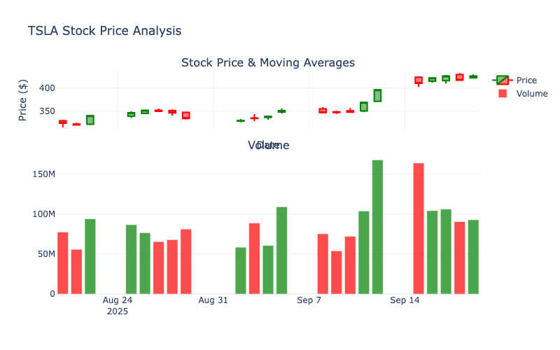
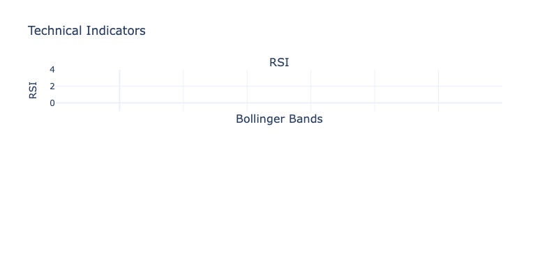

# 📊 TSLA Stock Analysis Report

**Generated on:** September 20, 2025 at 08:31 PM

---

## 📋 Executive Summary

**Current Price:** $426.07  
**Trend:** Strong Bullish  
**Sentiment:** Neutral  
**Analysis Period:** 1mo

---

## 🏢 Company Information

| Field | Value |
|-------|-------|
| Company | Tesla, Inc. |
| Sector | Consumer Cyclical |
| Industry | Auto Manufacturers |
| Market Cap | $1,416,747,155,456 |
| Beta | 2.065 |
| P/E Ratio | 256.66867 |

---

## 📈 Price Analysis

**Current Price:** $426.07  
**Price Change:** +9.22 (+2.21%)  
**Trend:** Strong Bullish  
**Volume:** 92,847,900  

The chart above shows the stock's price movement with moving averages and volume analysis.

---

## ⚙️ Technical Analysis

| Indicator | Value | Signal |
|-----------|-------|--------|
| RSI (14-day) | 85.98 | Overbought |
| 5-day MA | $420.09 | Above current price |
| 20-day MA | $366.35 | Above current price |
| Support Level | $319.69 | Key support |
| Resistance Level | $432.22 | Key resistance |

---

## 📰 Sentiment Analysis

Sentiment analysis not available.

---

## 📑 News Sources & Citations

No news articles were analyzed.

---

## 🎯 Investment Recommendation

## 🟢 STRONG BUY

**Technical Score:** 2.0  
**Sentiment Score:** 0.0  
**Combined Score:** 2.0

Based on the technical analysis and sentiment analysis, this is the recommended action for the stock.

---

## ⚠️ Disclaimer

This analysis is for informational purposes only and should not be considered as financial advice. 
Always conduct your own research and consult with qualified financial advisors before making investment decisions.

---

*Report generated by AI Stock Analyzer v0.1.0 | Powered by OpenAI GPT & yfinance*
